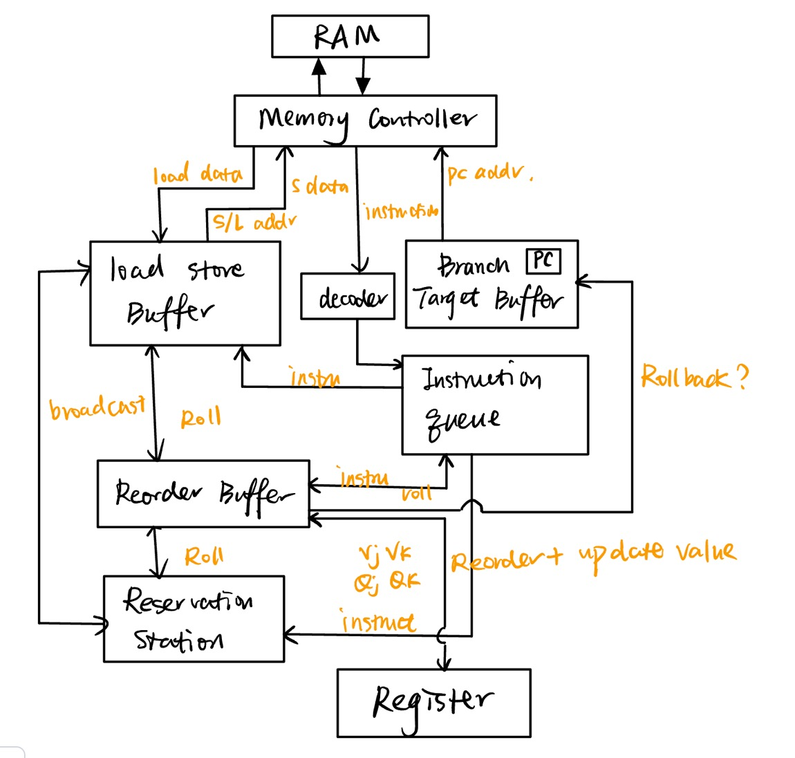

# RISC-V Tomasulo CPU Simulatior 🧐

#### Pass simulation！

OJ今天终于凉快了！快了五倍！！！！

### CPU最终架构图：

### 所需模块

- Register
- Reorder_Buffer
- Reservation_station
- Load_store_buffer
- Instruction_queue
- ALU
- Decoder
- Branch_Target_Buffer

### Instruction Fetch

##### **（1）Decoder**

解析从MemoryController fetch到的指令，主要区分是否为Load Store操作，还是别的操作

##### （2）Instruction Queue

将fetch 出来的指令暂时存在 Instruction Queue中，并起到区分指令发往 rob  rs lsb 的作用

##### （3）Branch Target Buffer

用于分支预测，pc也存在里面，有一个二位饱和计数器

#### Memory Controller

（1）带一个ICache

instruction cache，大小128，由于大小较小，Direct Mapping

（2）执行优先级为 Store > Load > Fetch

#### Reorder Buffer

（1）队列结构，顺序commit

（2）控制rollback

存下predict的结果，如果不一致，就发送rollback指令

（3）一次只commit一条指令，只有commit后才修改寄存器的值以保证正确性

（4）随时监听 rs lsb发来的 broadcast

#### Reservation Station

（1）乱序执行

（2）随时监听alu rob lsb发来的 broadcast

#### Load Store Buffer

（1）队列结构，顺序执行，顺序commit

（2）与 memory controller 交互

（3）随时监听 rs rob lsb发来的 broadcast

#### Register

（1）issue时用rob发来的entry进行重命名

（2）用且仅用 rob commit 的信息更新value或解除rename状态（很重要）