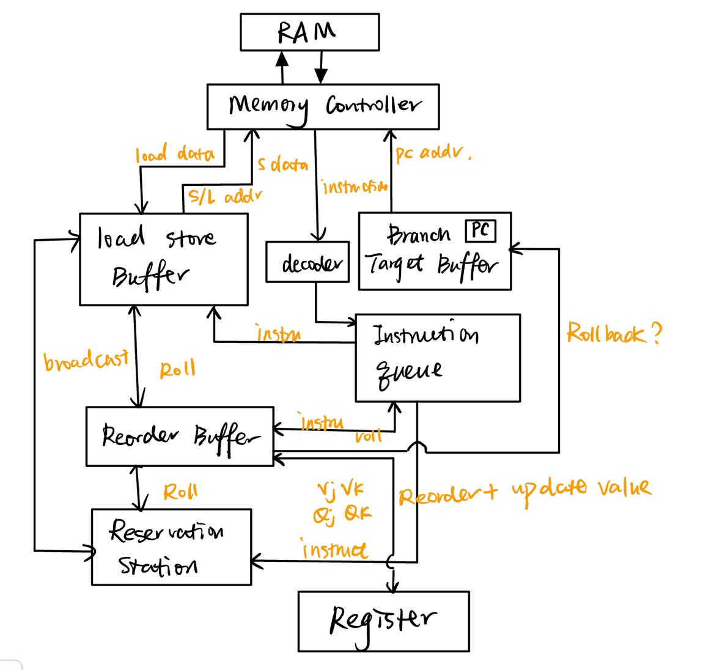

# RISC-V Tomasulo CPU Simulator 🧐

#### Pass simulation！

The OJ finally sped up today! It’s five times faster!!!! 🎉

Final CPU Architecture:

### Required Modules:

	•	Register
	•	Reorder Buffer
	•	Reservation Station
	•	Load Store Buffer
	•	Instruction Queue
	•	ALU
	•	Decoder
	•	Branch Target Buffer

### Instruction Fetch

- **Decoder**

  Decodes the instructions fetched from the MemoryController, primarily distinguishing between Load/Store operations and other operations.

- **Instruction Queue**

  Stores fetched instructions temporarily and determines whether they should be sent to the Reorder Buffer, Reservation Station, or Load Store Buffer.

- **Branch Target Buffer**

  Used for branch prediction, with the PC stored inside and a two-bit saturating counter for prediction.

#### Memory Controller

(1) Includes an ICache:

- Instruction cache with a size of 128.
- Uses Direct Mapping due to its relatively small size.

(2) Execution Priority:

- Store > Load > Fetch

#### Reorder Buffer (ROB)

1. Queue structure, commits instructions in order.

2. Controls rollbacks:

   Stores predicted results and issues rollback commands if predictions are incorrect.

3. Commits only one instruction at a time.

   Registers are updated only after committing to ensure correctness.

4. Continuously listens for broadcasts from Reservation Station and Load Store Buffer.

#### Reservation Station

1. Supports out-of-order execution.
2. Continuously listens for broadcasts from the ALU, ROB, and Load Store Buffer.

#### Load Store Buffer (LSB)

1. Queue structure with in-order execution and in-order commit.
2. Interacts with the Memory Controller.
3. Continuously listens for broadcasts from Reservation Station and ROB.

#### Register

1. Renames entries during issue using entries sent by the ROB.
2. Updates values or clears rename states only with information committed by the ROB (this is critical).

